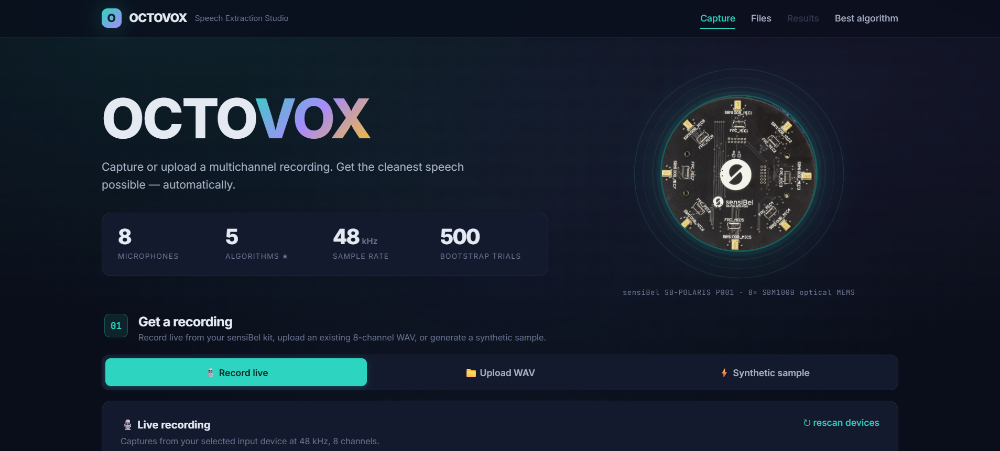
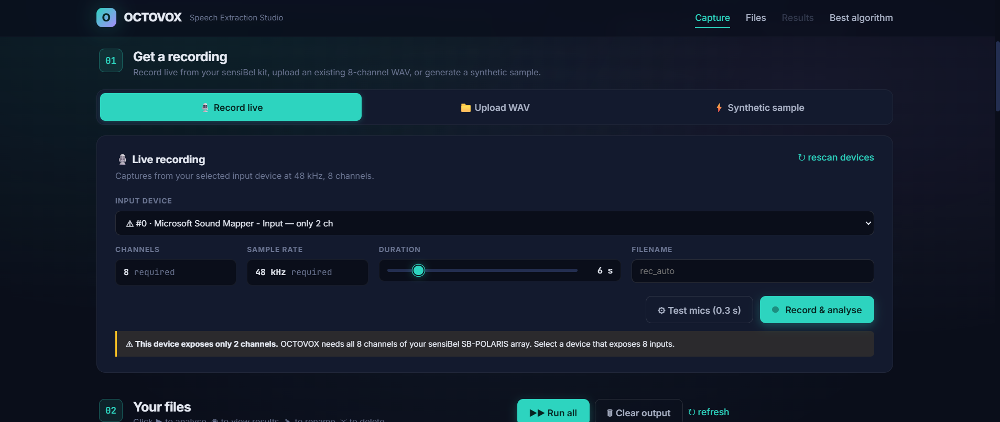
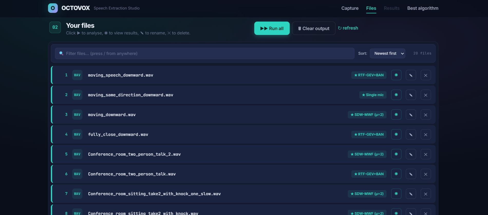
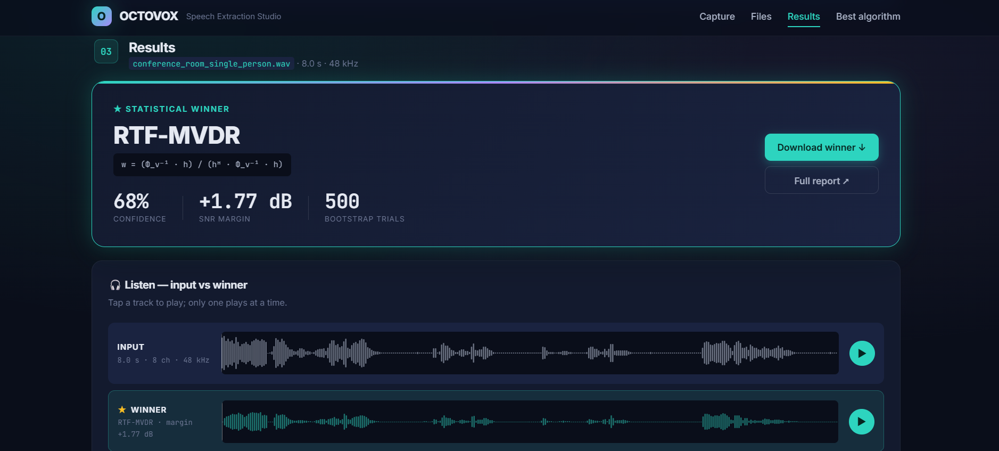
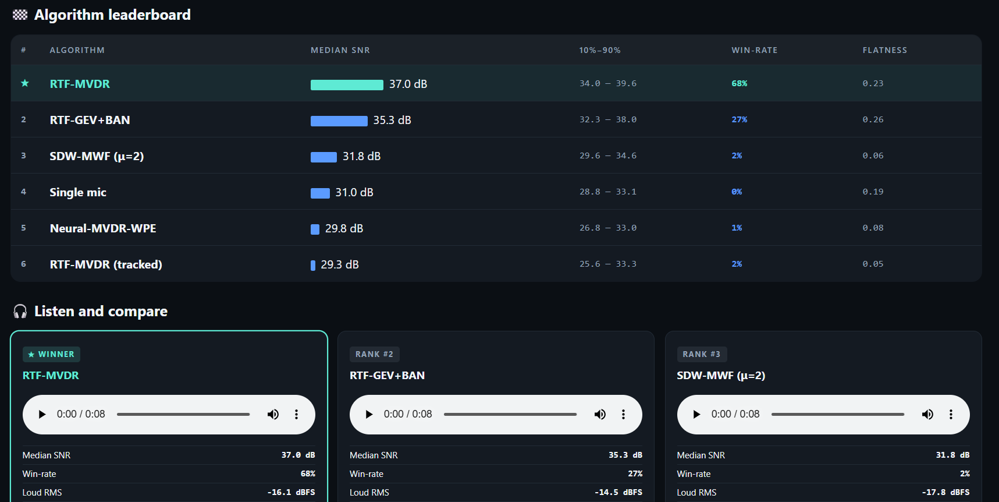
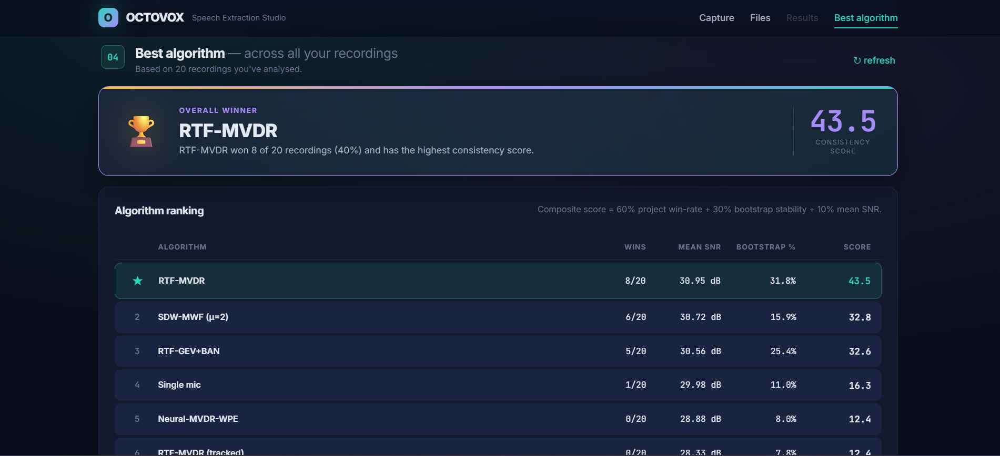
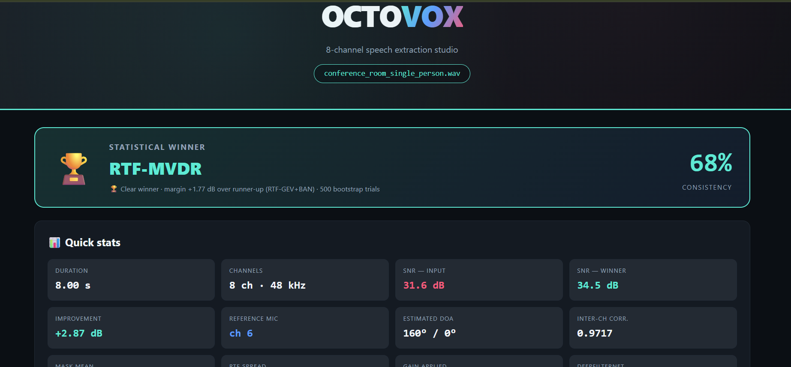
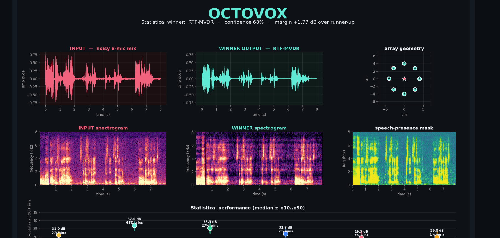
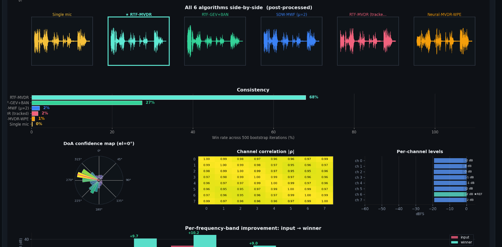

# OCTOVOX

**A web studio that pulls a clean voice out of noisy 8-channel microphone-array recordings.**

I built this around the [sensiBel SB-POLARIS](https://sensibel.com) array — eight optical MEMS
microphones recording at 48 kHz / 24-bit. The problem it solves is simple to say and hard to do:
when eight mics hear a room, *which* way of combining them gives you the cleanest speech? There's
no single answer that wins in every room. A quiet single speaker, two people talking over each
other, someone walking around mid-sentence — each one favours a different algorithm.

So OCTOVOX doesn't pick one and hope. It runs **several beamformers on the same recording**, scores
each result statistically, and tells you which one actually came out cleanest *for that recording* —
and how confident it is about the call. Then you can listen to them side by side and decide for
yourself.

It's a web page. Record or drop in a `.wav`, hit run, listen to the results.



---

## Contents

- [What you can do with it](#what-you-can-do-with-it)
- [A quick tour](#a-quick-tour)
- [Running it](#running-it)
- [How the competition works](#how-the-competition-works)
- [The microphone array](#the-microphone-array)
- [What it saves per recording](#what-it-saves-per-recording)
- [Project layout](#project-layout)
- [Command line](#command-line)
- [GPU acceleration](#gpu-acceleration-optional)
- [Tests](#tests)
- [Troubleshooting](#troubleshooting)
- [License](#license)

---

## What you can do with it

- 🎙️ **Capture** audio three ways — record live from the array, upload an existing 8-channel WAV, or
  generate a synthetic sample if you don't have the hardware.
- ⚙️ **Process** every recording through a panel of beamformers in one click, with a live progress bar.
- 🏆 **Compare** the results — a clear winner banner, a full leaderboard, and an audio player for
  every algorithm so you can A/B them by ear.
- 📊 **Aggregate** across many recordings to see which algorithm is the most reliable overall.
- 📄 **Share** a standalone `report.html` for any recording — every chart and number in one file,
  no server needed.

---

## A quick tour

### 1. Capture a recording

Record live from the array, drop in a `.wav`, or generate a synthetic sample. Whatever you feed it
is checked against the array spec (8 channels @ 48 kHz) before anything runs.



### 2. Manage your files

Everything you've captured shows up here. Each row remembers which algorithm last won for it. You can
filter, rename, delete, run them one at a time, or hit **Run all** to batch-process the lot.



### 3. Read the result

After a run you get the headline: the **statistical winner**, how confident OCTOVOX is, and the
margin over the runner-up. The player lets you hear the raw input against the cleaned-up winner
back to back.



Scroll down for the full leaderboard — every algorithm ranked by median SNR, win-rate, and flatness,
each with its own play button so you can listen and compare.



### 4. See the big picture

Once you've analysed a batch of recordings, the **Best algorithm** view rolls everything up: which
algorithm wins most often across all your recordings, and a composite consistency score so a single
lucky win doesn't crown the wrong one.



### 5. Share the report

Every run also writes a standalone `report.html` you can open in any browser or send to someone — no
server, no install. It packs the verdict, the signal analysis, and the full algorithm breakdown into
one file.

| Summary & quick stats | Signal analysis |
|:---:|:---:|
|  |  |



---

## Running it

```bash
git clone https://github.com/Raw2003/octovox.git
cd octovox
pip install -r requirements.txt
python run.py
```

Then open **http://127.0.0.1:5050**.

- **Linux:** for live recording you also need PortAudio — `sudo apt install -y libportaudio2`.
- **Windows / macOS:** the `pip install` covers everything for the core studio.
- **No hardware?** Click **Synthetic sample** on the home screen — it fakes an 8-channel recording so
  you can try the whole pipeline offline.

`run.py` builds the app through an app-factory (`octovox_app.create_app()`), prints a readiness banner
telling you which optional accelerators it found, and starts the server. No `sys.path` hacks, no
giant `app.py`.

---

## How the competition works

Five beamformers run on every recording out of the box (a sixth, **Neural-MVDR-WPE**, switches on
automatically if you install the neural extras):

| Algorithm | What it is |
|-----------|------------|
| **Single mic** | The best individual channel — the baseline everything else has to beat |
| **RTF-MVDR** | Minimum-variance distortionless response steered by a relative transfer function |
| **RTF-GEV + BAN** | Generalized-eigenvalue beamformer with blind analytic normalization |
| **SDW-MWF (μ=2)** | Speech-distortion-weighted multichannel Wiener filter |
| **RTF-MVDR (tracked)** | A time-varying MVDR that *follows* a speaker who moves mid-recording |
| **Neural-MVDR-WPE** *(optional)* | WPE dereverberation + Silero VAD + MVDR (needs the neural deps) |

Picking a winner from a single SNR number is fragile, so OCTOVOX doesn't. Here's the judging:

```
        8-channel recording
                │
   ┌────────────┼────────────┬────────────┬───────────────┐
   ▼            ▼            ▼            ▼               ▼
 Single      RTF-MVDR    RTF-GEV+BAN   SDW-MWF      RTF-MVDR
  mic                                  (μ=2)        (tracked)
   │            │            │            │               │
   └────────────┴─────┬──────┴────────────┴───────────────┘
                      ▼
            500-iteration bootstrap
        (slice each output into ~30 ms windows,
         label them speech/silence, resample, score SNR)
                      ▼
            🏆  Winner + consistency %
```

Each algorithm's output is chopped into ~30 ms windows, tagged as speech or silence against the input
envelope, and then **resampled 500 times** to build a proper SNR distribution instead of one brittle
number. The winner is whichever algorithm led most often across those 500 rounds — and that
"led-most-often" percentage is the **consistency score** you see in the banner. A winner at 98%
wasn't luck; one at 55% means it was a close call, and OCTOVOX tells you so.

The **Best algorithm** view then aggregates this across every recording you've processed, blending
project-level win-rate, average bootstrap win-rate, and mean SNR into one composite score so the most
*reliable* algorithm rises to the top — not just the one that got lucky once.

---

## The microphone array

OCTOVOX is tuned for the **sensiBel SB-POLARIS P001** kit:

- 8 × SBM100B optical MEMS microphones
- Uniform circular array, ~40 mm radius (planar — not a cube)
- Phase-matched, 24-bit, 48 kHz over TDM/USB

You don't strictly need that exact hardware — any **8-channel, 48 kHz** WAV will run. The array
geometry is configurable, so other layouts work too (see [Command line](#command-line)).

---

## What it saves per recording

Every run writes a self-contained folder under `data/output/<recording-name>/`:

```
01_Single_mic.wav        each algorithm's output audio
02_RTF-MVDR.wav
03_RTF-GEV_BAN.wav
04_SDW-MWF_mu2.wav
05_RTF-MVDR_tracked.wav
visualization.png        waveforms, beam pattern, direction-of-arrival
report.html              open in any browser — the full verdict, standalone
metrics.json             every raw number, bootstrap stat, and DoA estimate
```

The `report.html` is the one to share — double-click it and the whole analysis opens, no server
required.

---

## Project layout

The web layer and the DSP are deliberately kept apart — you can drive the entire pipeline from the
command line without Flask ever loading.

```
octovox/
├── run.py                   ▶ start here:  python run.py
├── requirements.txt
├── octovox_app/             the Flask application
│   ├── __init__.py          create_app() factory
│   ├── config.py            paths, host/port, upload limits
│   ├── routes/
│   │   ├── pages.py         the page + serving output files
│   │   └── api.py           every /api/... endpoint
│   ├── services/
│   │   ├── pipeline.py      the DSP brain — beamformers, bootstrap, plots
│   │   └── verdicts.py      rolls results up across many recordings
│   ├── utils/               wav reading, path-safety, job tracking
│   ├── templates/           index.html
│   └── static/              app.js, style.css, assets
├── data/
│   ├── input/               your recordings (a few samples included)
│   └── output/              results land here (starts empty)
├── docs/screenshots/        the images in this README
└── tests/
```

---

## Command line

The DSP runs standalone — no browser, no Flask:

```bash
python -m octovox_app.services.pipeline \
    --wav data/input/Conference_room_two_person_talk.wav \
    --geometry uca_polaris_40mm
```

Geometries available: `uca_polaris_40mm` (default), `uca_30mm`, `uca_50mm`, `cube_4cm`.

---

## GPU acceleration (optional)

It runs fine on a laptop CPU. If you have an NVIDIA card, two independent layers can move to the GPU:

```bash
# 1) Neural models (Silero VAD, DeepFilterNet) — match the wheel to your Python + CUDA driver
pip install torch torchaudio --index-url https://download.pytorch.org/whl/cu128

# 2) The heavy DSP (the speaker tracker + masked covariance build) via CuPy
pip install "cupy-cuda13x[ctk]"     # CUDA 13.x driver
pip install "cupy-cuda12x[ctk]"     # CUDA 12.x driver
```

The startup banner prints what it found. Force the CPU path anytime with `OCTOVOX_GPU=0`.

<details>
<summary>Windows note on import order</summary>

CuPy must initialise its CUDA libraries before `torch` is imported, or cuBLAS fails to load.
`pipeline.py` already imports CuPy first and warms it up, so this is handled — just keep that ordering
if you refactor the imports.
</details>

---

## Tests

```bash
pip install pytest
pytest -q
```

---

## Troubleshooting

- **My upload got rejected.** The spec is strict on purpose: exactly 8 channels at 48 kHz, WAV/PCM.
  The error tells you what it got versus what it wanted — re-export to match.
- **"Missing optional deps" at startup.** That's fine. It just means the Neural-MVDR-WPE slot is
  skipped; the five core beamformers still run. Install `nara-wpe` + `torch` to enable it.
- **Garbled characters in the Windows console.** `run.py` forces UTF-8 on startup, so the banners
  render even on a default cp1252 console.
- **Where did my old results go?** `data/output/` is disposable. The **Clear output** button (and
  `POST /api/clear_output`) wipes analysis folders but never touches your input recordings.

---

## License

MIT — see [LICENSE](LICENSE). The beamforming and statistical methods come from published papers; the
specific references are cited in the docstrings inside `octovox_app/services/pipeline.py`.
